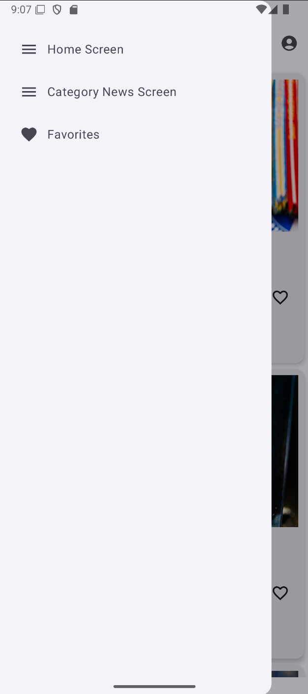
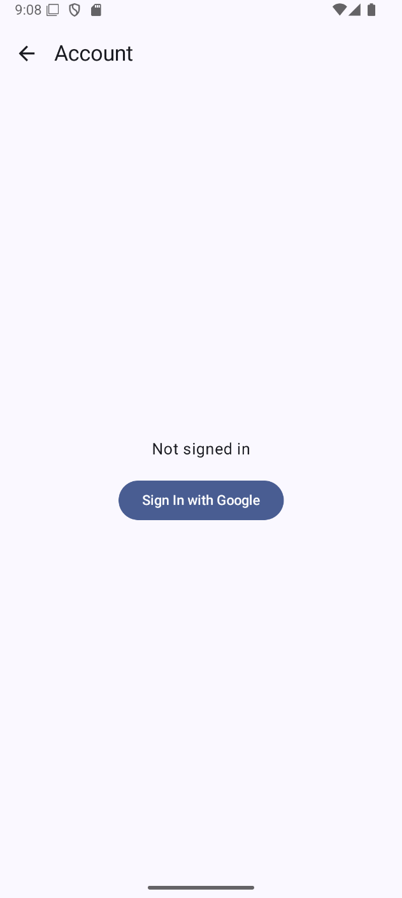

#  QuickNews

Ứng dụng Android đọc tin tức

✅ Đọc tin theo chuyên mục  
✅ Tìm kiếm bài viết  
✅ Xem chi tiết bài báo  
✅ Đăng nhập bằng Google  
✅ Lưu bài yêu thích  

##  Demo

| Home Screen | Drawer Menu |
|-------------|-------------|
|  |  |

| Category News Screen | Account Screen |
|----------------------|----------------|
|  |  |

---

##  Tính năng chính

- 📰 **Top Headlines**: Xem các tin tức nổi bật hàng ngày  
- 🏷 **Category News**: Lọc tin theo chuyên mục (Business, Health, Science, Technology, Sports, Entertainment, General)  
- 🔍 **Search News**: Tìm kiếm bài viết theo từ khóa  
- ⭐ **Favorites**: Thêm / xoá bài yêu thích (có đồng bộ server)  
- 👤 **Account**: Đăng nhập / đăng xuất với Google, quản lý tài khoản cá nhân  

##  Công nghệ sử dụng

###  Language

- Kotlin

###  Framework / Libraries

- **Jetpack Compose**: UI hiện đại
- **Navigation Compose**: Điều hướng màn hình
- **Retrofit2 + Gson**: Giao tiếp REST API
- **Google Sign-In**: Đăng nhập Google
- **StateFlow + ViewModel**: Quản lý trạng thái
- **Coil**: Load ảnh
- **Material 3**: Thiết kế Material mới nhất

